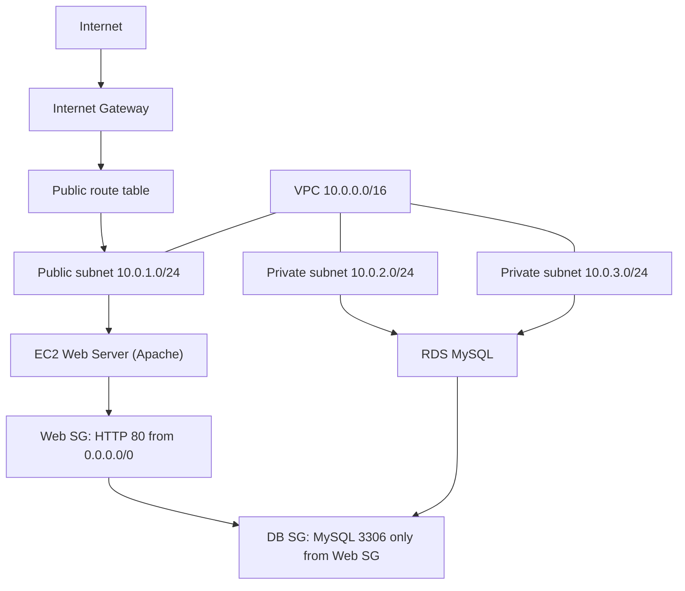

<div align="center">

# Terraform Modular AWS Infrastructure

**English** | [Español](README.es.md)

[](https://developer.hashicorp.com/terraform/install)


</div>

<strong>Terraform Modular AWS Infrastructure</strong> deploys a three-tier web application on AWS with Infrastructure as Code (IaC). Every layer lives in its own Terraform module — networking, compute and database — so each resource group can be read, reused and evolved independently.

The goal is not to run one big script. It's to learn and apply a safe infrastructure cycle:

```text
inspect → change the minimum → verify → observe → document
```

> **Important:** This is a learning project and a starting template. It does not replace the change, review, backup and security policies of an organization.

---

## Table of Contents

- [What problem it solves](#what-problem-it-solves)
- [What it includes](#what-it-includes)
- [Project structure](#project-structure)
- [Architecture](#architecture)
- [Operational flow](#operational-flow)
- [Technologies](#technologies)
- [Security](#security)
- [Outputs & observability](#outputs--observability)
- [Testing](#testing)
- [Installation](#installation)
- [Quick start](#quick-start)
- [Environments & deployment](#environments--deployment)
- [Configuration](#configuration)
- [Documentation](#documentation)
- [Contact](#contact)

---

## What problem it solves

A web application is not a single machine. It involves at least a private network, a public web server and a relational database that must talk to each other in a safe way.

This project turns that scenario into reproducible, modular Terraform code. Each component lives in its own module, and modules are wired together through **variables** (inputs) and **outputs** — no hardcoded IDs, no duplicated blocks.

---

## What it includes

### Networking — `modules/vpc`

- VPC with DNS hostnames enabled.
- Public subnet with auto-assigned public IPs.
- Internet Gateway and public route table.
- Two private subnets in **different availability zones** (required by RDS).
- CIDR ranges and AZs configured through variables.

### Compute — `modules/compute`

- EC2 instance on the latest official **Amazon Linux 2023** AMI (discovered via a data source).
- Security Group exposing inbound HTTP (port 80) only.
- *User data* script that installs and starts Apache automatically on first boot.

### Database — `modules/database`

- RDS MySQL 8.0 inside the private subnets.
- DB Subnet Group spanning two AZs.
- Security Group that accepts MySQL (3306) **only from the web Security Group** — not from arbitrary IPs.
- Password handled as a `sensitive` variable.

### Resources created

| Module | Resources |
| :--- | :--- |
| `vpc` | VPC, 2 public/private subnets, Internet Gateway, route table + association |
| `compute` | Web Security Group, EC2 instance |
| `database` | DB Subnet Group, DB Security Group, RDS MySQL instance |

---

## Project structure

```text
infraestructura-modular/
├── .gitignore               # Ignore secrets, tfstate and .terraform/
├── .terraform.lock.hcl      # Provider version lock (commit it)
├── README.md
├── README.en.md
├── main.tf                  # Module orchestration
├── variables.tf             # Global variables
├── outputs.tf               # web_public_ip, database_endpoint...
├── versions.tf              # Terraform & AWS provider requirements
├── dev.tfvars.example       # Template for development (no secrets)
├── prod.tfvars.example      # Template for production (no secrets)
└── modules/
    ├── vpc/                 # VPC, subnets, IGW, routing
    │   ├── main.tf
    │   ├── variables.tf
    │   └── outputs.tf
    ├── compute/             # EC2 + Security Group + user data
    │   ├── main.tf
    │   ├── variables.tf
    │   └── outputs.tf
    └── database/            # RDS MySQL + DB Subnet Group + SG
        ├── main.tf
        ├── variables.tf
        └── outputs.tf
```

---

## Architecture



No destructive change runs implicitly: every modification is explicit in the configuration and goes through the plan/review cycle before apply.

---

## Operational flow

### Provisioning

```text
init → validate → plan → review → apply → verify → destroy
```

### Verification after apply

```text
terraform output web_public_ip    → open it in the browser
terraform output database_endpoint → endpoint of the private DB
```

### Cleanup

```text
terraform destroy -var-file="dev.tfvars"
```

---

## Technologies

| Technology | Use |
| :--- | :--- |
| Terraform `>= 1.5` | Infrastructure orchestration. |
| AWS Provider `~> 5.0` | Manages resources through the AWS API. |
| Amazon Linux 2023 | Base image for the web server. |
| Apache `httpd` | Web service installed via user data. |
| RDS MySQL 8.0 | Managed relational database. |

---

## Security

- `*.tfvars` are in `.gitignore`: **never** commit passwords or secrets. We only commit `*.tfvars.example` templates.
- The database password is declared as `sensitive` and is never shown in the console.
- The database Security Group references the web Security Group ID instead of a fixed IP.
- Only port 80 is open to the internet.
- `terraform.tfstate` (local state) is gitignored — plan for a remote backend before sharing state.

---

## Outputs & observability

Terraform reports the created endpoints right after apply:

```bash
terraform output                      # all outputs
terraform output web_public_ip        # only the web IP
```

For incident analysis you can inspect the current state:

```bash
terraform show                        # state as resource graph
terraform state list                  # every tracked resource
```

---

## Testing

Local validation is quick and needs no AWS credentials:

```bash
terraform fmt -check -recursive       # formatting
terraform validate                    # syntax + module wiring
terraform plan -var-file="dev.tfvars" # preview every change before apply
```

---

## Installation

**Requirements:** Terraform `>= 1.5`, a Git client, an AWS account and configured credentials (`aws configure` or `AWS_ACCESS_KEY_ID` / `AWS_SECRET_ACCESS_KEY`).

```bash
git clone <your-repo-url>.git
cd infraestructura-modular
terraform init          # downloads the AWS provider and prepares modules
```

> The `.terraform.lock.hcl` lock file keeps the provider version stable across machines.

---

## Quick start

```bash
# 1. Prepare your variables from the template
copy dev.tfvars.example dev.tfvars        # Linux: cp dev.tfvars.example dev.tfvars

# 2. Initialize modules and the AWS provider
terraform init

# 3. Preview the changes
terraform plan -var-file="dev.tfvars"

# 4. Deploy
terraform apply -var-file="dev.tfvars"

# 5. When done, destroy everything to avoid costs
terraform destroy -var-file="dev.tfvars"
```

After apply, copy `web_public_ip` into your browser: you will see the welcome page installed by the user data script.

---

## Environments & deployment

The same modules support multiple environments through separate variable files:

| Environment | Command | Notes |
| :--- | :--- | :--- |
| Development | `terraform apply -var-file="dev.tfvars"` | `t2.micro` instance. |
| Production | `terraform apply -var-file="prod.tfvars"` | Bigger instance types. |

The `environment` variable (default `dev`) is propagated to every module and is used in resource tags and names.

---

## Configuration

`dev.tfvars.example` and `prod.tfvars.example` define the configuration surface. Copy them without the `.example` suffix and fill in your values — the real files stay ignored by Git.

| Variable | Type | Example |
| :--- | :--- | :--- |
| `region` | `string` | `us-east-1` |
| `vpc_cidr` | `string` | `10.0.0.0/16` |
| `public_subnet_cidr` | `string` | `10.0.1.0/24` |
| `private_subnet_cidr` | `string` | `10.0.2.0/24` |
| `private_subnet_cidr_2` | `string` | `10.0.3.0/24` |
| `instance_type` | `string` | `t2.micro` |
| `environment` | `string` | `dev` |
| `db_password` | `string` (sensitive) | `CAMBIAR_POR_TU_CONTRASEÑA` |

---

## Documentation

| File | Content |
| :--- | :--- |
| [`README.md`](README.md) | Overview, architecture and quick start (English). |
| [`README.es.md`](README.es.md) | Overview, architecture and quick start (Spanish). |
| [`modules/vpc/`](modules/vpc) | Networking module code. |
| [`modules/compute/`](modules/compute) | Compute module code. |
| [`modules/database/`](modules/database) | Database module code. |
| [`versions.tf`](versions.tf) | Terraform and provider requirements. |
| [`dev.tfvars.example`](dev.tfvars.example) | Development variable template. |
| [`prod.tfvars.example`](prod.tfvars.example) | Production variable template. |

---

## Contact

If you have any questions or feedback, feel free to reach out!

- **Email:** [gonzalezleyver6@gmail.com](mailto:gonzalezleyver6@gmail.com)
- **LinkedIn:** [Leyver Aaron Gonzalez Mendoza](https://www.linkedin.com/in/leyver-aaron-gonzalez-mendoza-7026a73a8/)