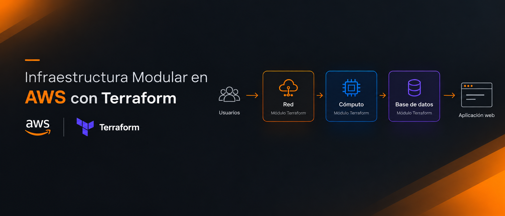
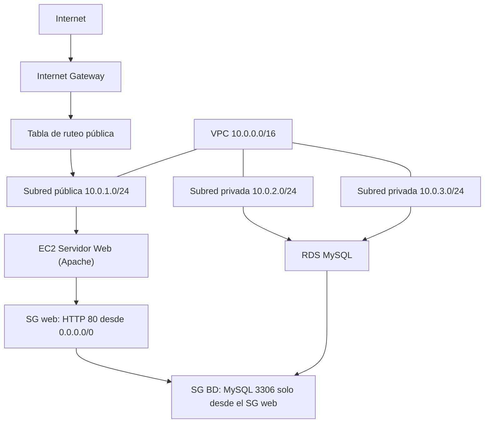

<div align="center">

# Infraestructura Modular en AWS con Terraform

**Español** | [English](README.en.md)

[](https://developer.hashicorp.com/terraform/install)




</div>

<strong>Infraestructura Modular en AWS con Terraform</strong> despliega una aplicación web de tres capas en AWS usando Infraestructura como Código (IaC). Cada capa vive en su propio módulo de Terraform — red, cómputo y base de datos — de modo que cada grupo de recursos puede leerse, reutilizarse y evolucionarse de forma independiente.

> **Importante:** Este es un proyecto de aprendizaje y una plantilla inicial. No reemplaza las políticas de cambio, revisión, backup y seguridad de una organización.

---

## Índice

- [Qué problema resuelve](#qué-problema-resuelve)
- [Qué incluye](#qué-incluye)
- [Estructura del proyecto](#estructura-del-proyecto)
- [Arquitectura](#arquitectura)
- [Flujo operativo](#flujo-operativo)
- [Tecnologías](#tecnologías)
- [Seguridad](#seguridad)
- [Salidas y observabilidad](#salidas-y-observabilidad)
- [Testing](#testing)
- [Instalación](#instalación)
- [Uso rápido](#uso-rápido)
- [Entornos y despliegue](#entornos-y-despliegue)
- [Configuración](#configuración)
- [Documentación](#documentación)
- [Contacto](#contacto)

---

## Qué problema resuelve

Una aplicación web no es una sola máquina. Implica al menos una red privada, un servidor web público y una base de datos relacional que deben comunicarse entre sí de forma segura.

Este proyecto convierte ese escenario en código Terraform reproducible y modular. Cada componente vive en su propio módulo y los módulos se conectan mediante **variables** (entradas) y **outputs** (salidas) — sin IDs hardcodeados, sin bloques duplicados.

## El Objetivo

Este proyecto demuestra cómo diseñar y desplegar infraestructura AWS
reproducible utilizando Terraform como herramienta de Infrastructure
as Code.

El enfoque principal es:

- modularidad
- reproducibilidad
- separación de responsabilidades
- seguridad de red
- automatización
- gestión de entornos

---

## Qué incluye

```text 
┌─────────────────────────────────────────────────────────────┐
│                    PROJECT HIGHLIGHTS                       │
├──────────────┬──────────────┬──────────────┬────────────────┤
│ Terraform    │ AWS          │ Modular IaC  │ 3-Tier         │
│              │              │              │ Architecture   │
├──────────────┼──────────────┼──────────────┼────────────────┤
│ EC2          │ RDS          │ VPC          │ Security Groups│
└──────────────┴──────────────┴──────────────┴────────────────┘
```

### Red — `modules/vpc`

- VPC con DNS hostnames habilitado.
- Subred pública con IP pública automática al lanzar instancias.
- Internet Gateway y tabla de ruteo pública.
- Dos subredes privadas en **zonas de disponibilidad distintas** (requisito de RDS).
- Rangos CIDR y zonas configurados mediante variables.

### Cómputo — `modules/compute`

- Instancia EC2 Amazon Linux 2023 mediante data source de AWS
- Security Group que solo expone HTTP entrante (puerto 80).
- Script de *User Data* que instala y arranca Apache automáticamente al encender.

### Base de datos — `modules/database`

- RDS MySQL 8.0 dentro de las subredes privadas.
- DB Subnet Group que abarca dos AZs.
- Security Group que acepta MySQL (3306) **únicamente desde el Security Group web** — no desde IPs arbitrarias.
- La contraseña se maneja como variable `sensitive`.

### Recursos creados

| Módulo | Recursos |
| :--- | :--- |
| `vpc` | VPC, subredes públicas/privadas, Internet Gateway, tabla de ruteo + asociación |
| `compute` | Security Group web, instancia EC2 |
| `database` | DB Subnet Group, Security Group de BD, instancia RDS MySQL |

---

## Estructura del proyecto

```text
infraestructura-modular/
├── .gitignore               # Ignora secretos, tfstate y .terraform/
├── .terraform.lock.hcl      # Bloqueo de versión del provider (commitealo)
├── README.md
├── README.en.md
├── main.tf                  # Orquestación de módulos
├── variables.tf             # Variables globales
├── outputs.tf               # web_public_ip, database_endpoint...
├── versions.tf              # Requisitos de Terraform y provider AWS
├── dev.tfvars.example       # Plantilla para desarrollo (sin secretos)
├── prod.tfvars.example      # Plantilla para producción (sin secretos)
└── modules/
    ├── vpc/                 # VPC, subredes, IGW, ruteo
    │   ├── main.tf
    │   ├── variables.tf
    │   └── outputs.tf
    ├── compute/             # EC2 + Security Group + user data
    │   ├── main.tf
    │   ├── variables.tf
    │   └── outputs.tf
    └── database/            # RDS MySQL + DB Subnet Group + SG
        ├── main.tf
        ├── variables.tf
        └── outputs.tf
```

---

## Arquitectura



No se ejecutan cambios destructivos de forma implícita: toda modificación es explícita en la configuración y pasa por el ciclo de plan/revisión antes del apply.

---

## Flujo operativo

### Aprovisionamiento

```text
init → validate → plan → review → apply → verify → destroy
```

### Verificación tras el apply

```text
terraform output web_public_ip    → ábrela en el navegador
terraform output database_endpoint → endpoint de la BD privada
```

### Limpieza

```text
terraform destroy -var-file="dev.tfvars"
```

---

## Tecnologías

| Tecnología | Uso |
| :--- | :--- |
| Terraform `>= 1.5` | Orquestación de infraestructura. |
| AWS Provider `~> 5.0` | Gestiona los recursos a través de la API de AWS. |
| Amazon Linux 2023 | Imagen base del servidor web. |
| Apache `httpd` | Servicio web instalado mediante user data. |
| RDS MySQL 8.0 | Base de datos relacional administrada. |

---

## Seguridad

- Los `*.tfvars` están en `.gitignore`: **nunca** subas contraseñas ni secretos. Solo se commitean las plantillas `*.tfvars.example`.
- La contraseña de la base de datos está declarada como `sensitive` y nunca se muestra en consola.
- El Security Group de la BD referencia el ID del Security Group web en lugar de una IP fija.
- Solo el puerto 80 está abierto a internet.
- `terraform.tfstate` (estado local) está ignorado por Git — plantea un backend remoto antes de compartir el estado.

---

## Salidas y observabilidad

Terraform reporta los endpoints creados justo después del apply:

```bash
terraform output                      # todas las salidas
terraform output web_public_ip        # solo la IP web
```

Para investigar un incidente puedes inspeccionar el estado actual:

```bash
terraform show                        # estado como grafo de recursos
terraform state list                  # cada recurso rastreado
```

---

## Testing

La validación local es rápida y no requiere credenciales de AWS:

```bash
terraform fmt -check -recursive       # formato
terraform validate                    # sintaxis + conexión de módulos
terraform plan -var-file="dev.tfvars" # previsualiza cada cambio antes del apply
```

---

## Instalación

**Requisitos:** Terraform `>= 1.5`, un cliente de Git, una cuenta de AWS y credenciales configuradas (`aws configure` o `AWS_ACCESS_KEY_ID` / `AWS_SECRET_ACCESS_KEY`).

```bash
git clone <tu-url-del-repo>.git
cd infraestructura-modular
terraform init          # descarga el provider de AWS y prepara los módulos
```

> El archivo de bloqueo `.terraform.lock.hcl` mantiene estable la versión del provider entre máquinas.

---

## Uso rápido

```bash
# 1. Prepara tus variables desde la plantilla
copy dev.tfvars.example dev.tfvars        # Linux: cp dev.tfvars.example dev.tfvars

# 2. Inicializa módulos y el provider de AWS
terraform init

# 3. Previsualiza los cambios
terraform plan -var-file="dev.tfvars"

# 4. Despliega
terraform apply -var-file="dev.tfvars"

# 5. Al terminar, destruye todo para evitar costos
terraform destroy -var-file="dev.tfvars"
```

Tras el apply, copia `web_public_ip` en tu navegador: verás la página de bienvenida instalada por el script de user data.

---

## Entornos y despliegue

La infraestructura utiliza una misma base modular y cambia su configuración
mediante archivos `.tfvars`.


| Entorno | Comando | Notas |
| :--- | :--- | :--- |
| Desarrollo | `terraform apply -var-file="dev.tfvars"` | Instancia `t2.micro`. |
| Producción | `terraform apply -var-file="prod.tfvars"` | Tipos de instancia mayores. |

Esto permite mantener una única definición de infraestructura mientras
se modifican parámetros como:

- región
- tipo de instancia
- CIDR
- nombres
- entorno

La variable `environment` (default `dev`) se propaga a todos los módulos y se usa en los tags y nombres de los recursos.

---

## Configuración

`dev.tfvars.example` y `prod.tfvars.example` definen la superficie de configuración. Cópialos sin el sufijo `.example` y rellena tus valores — los archivos reales quedan ignorados por Git.

| Variable | Tipo | Ejemplo |
| :--- | :--- | :--- |
| `region` | `string` | `us-east-1` |
| `vpc_cidr` | `string` | `10.0.0.0/16` |
| `public_subnet_cidr` | `string` | `10.0.1.0/24` |
| `private_subnet_cidr` | `string` | `10.0.2.0/24` |
| `private_subnet_cidr_2` | `string` | `10.0.3.0/24` |
| `instance_type` | `string` | `t2.micro` |
| `environment` | `string` | `dev` |
| `db_password` | `string` (sensitive) | `CAMBIAR_POR_TU_CONTRASEÑA` |

---

## Documentación

| Archivo | Contenido |
| :--- | :--- |
| [`README.md`](README.md) | Visión general, arquitectura y uso rápido (inglés). |
| [`README.es.md`](README.es.md) | Visión general, arquitectura y uso rápido (español). |
| [`modules/vpc/`](modules/vpc) | Código del módulo de red. |
| [`modules/compute/`](modules/compute) | Código del módulo de cómputo. |
| [`modules/database/`](modules/database) | Código del módulo de base de datos. |
| [`versions.tf`](versions.tf) | Requisitos de Terraform y del provider. |
| [`dev.tfvars.example`](dev.tfvars.example) | Plantilla de variables de desarrollo. |
| [`prod.tfvars.example`](prod.tfvars.example) | Plantilla de variables de producción. |

---

## Contacto

Si tienes alguna pregunta o feedback, ¡no dudes en escribirme!

- **Correo:** [gonzalezleyver6@gmail.com](mailto:gonzalezleyver6@gmail.com)
- **LinkedIn:** [Leyver Aaron Gonzalez Mendoza](https://www.linkedin.com/in/leyver-aaron-gonzalez-mendoza-7026a73a8/)